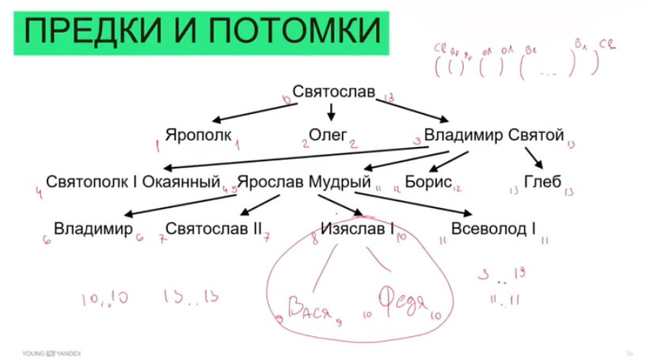
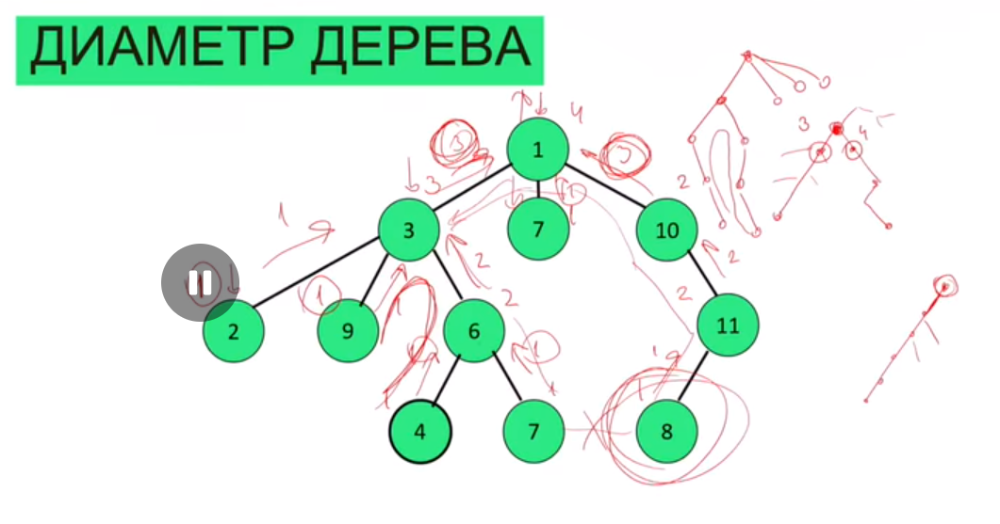
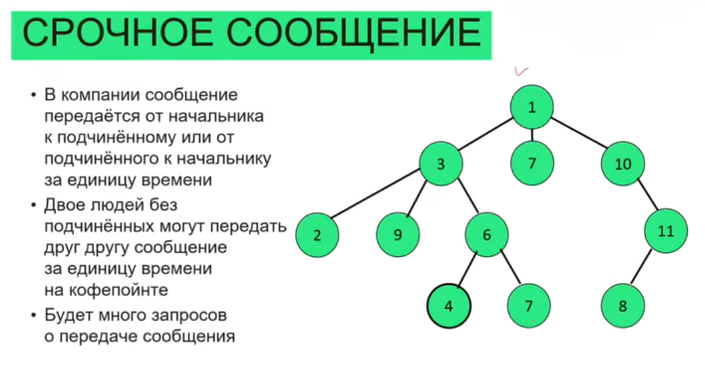
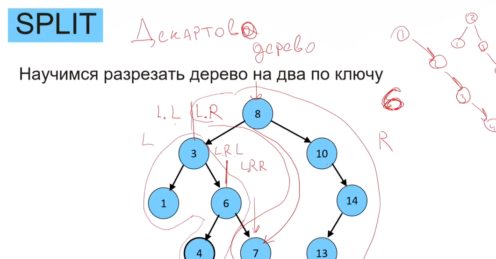
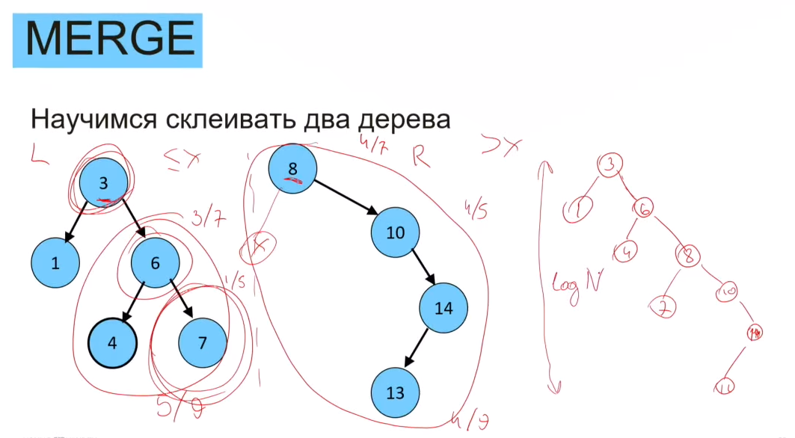
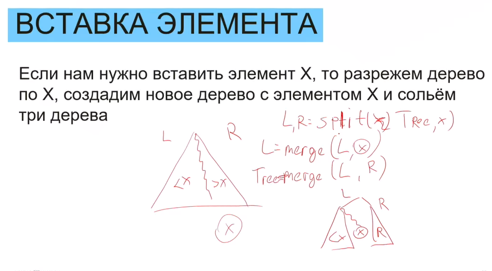
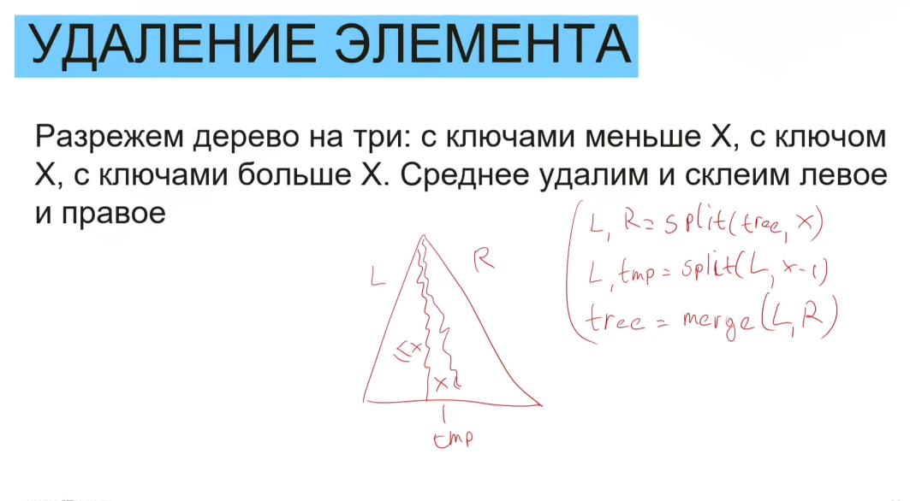

# Деревья

Дерево - это иерархическая совокупононсть корня, узлов и листов.
Поддерево - часть дерева с корнем в каком-то узле

Как хранить дерево? В виде модели типа `[имя, [списки_для_кажого ребенка]]`:
`['Святослав', [['Ярополк', []], ['Олег', []], ['Владимир святой', [...]]]]`



## Деревья поиска

### Бинарное дерево поиска

На нем можно реализовать множество. Как ? Договоримся, что слева находятся ключи меньшие рассматриваемого,
а справа наоборот, большие рассматриваемого.

`[5, [2, None, [3, None, None]], [7, None, [8, None, None]]]`

### Поиск ключа

Запускаем рекурсивную функцию, ищущую значение ключа.
До тех пор, пока в рассматриваемом узле не лежит необходимого значения, проверяем:
1) Значение искомого ключа *больше* рассматриваемого ? Если да, то переходим к рассмотрению правого узла.
2) Если же значение искомного ключа *меньше* рассматриваемого, то переходим к рассмотрению левого узла.

### Добавление ключа

Вставка осуществляется в несуществующий лист, аналогично поиску.

### Удаление ключа

В настоящих проектах удаленные листы помечают, как удаленные, чтобы они не участвовали в поиске.
Это делают так, чтобы часто не было перестроений дерева, ведь удалить можно не только листы, но и узлы.
Просто в какой-то момент в будущем далее этот лист, узел будет удален наверняка во время глобальной очистки мусора.

Если значение удаляемого ключа лежит в листе, то все отлично. Мы просто удаляем этот лист.

#### удаление элемента, у которого 1 потомок.

Если же значение удаляемого ключа лежит в *узле*, то мы подвешиваем на предка удаляемого узла "Левый дочерний узел".

#### удаление элемента, у которого 2 потомка.

Если же значение удаляемого ключа лежит в *узле*, у которого есть связи на два своих потомка, то тут нужно за место удаляемого ключа поставить значение:
1) либо минимального значения из ключей, больших удаляемого (min(greater_numbers_then_removing_node)). Очевидно, что все эти числа будут лежать справа от удаляемого и чтобы найти такое число, нужно идти по левой части правого поддерева.
2) либо максимального значения из ключей, меньших удалемого (max(less_numbers_then_removing_node)). Очевидно, что эти числа будут лежать слева от удаляемого и чтобы найти такое число, нужно идти по правой части левого поддерева.

После того, как мы нашли подходящий ключ, мы просто заменим значение удаляемого узла на то, которое нашли либо через (1), либо через (2).

### Обход дерева

Существует 3 варианта обхода:
```
Pre-order
In-order
Post-order
```
Нас интересует тот, который позволяет получить отсортированный массив в возрастающем порядке.

```
rec(node):
    rec(node.left)
    print(node.key)
    rec(node.right)
```

## Задачи на деревьях (не только бинарных)

### "Диаметр дерева"

Диаметр дерева - это максимальное расстояние
Диаметр дерева - это количество рёбер на пути между двумя самыми удаленными вершинами.

Нужно найти этот диаметр.
**Способ 1.** Мы можем сначала для каждого поддерева определить его глубину. Как это будем делать ?
1. Мы у всех детей спросим, какая у вас глубина ? Каждый из них ответит глубину своего поддерева. 
2. Поскольку мы хотим найти максимальную глубину, то мы среди всех детей возьмем максимум и прибавим единичку, учитывая себя, и передадим наверх.

Как это поможет решить задачу про диаметр дерева ?
Теперь у нас каждый узел знает глубину поддерева, для которого он является корнем. Это делается так, как описано выше - для всех детей проходим рекурсивной функцией и спрашиваем. К ответу +1.

Как выглядит самый длинный путь ?
1. Либо самый длинный путь лежит в корне и по сути это просто глубина дерева,
2. Либо путь где-то будет перегибаться и как тогда нам найти этот путь ? Переберём точки потенциальные перегиба и фактически решим задачу: "Какой самый длинный путь проходит через эту вершину и полностью лежит в этом поддереве ?"

- (В) Как это посчитать ?
- (О) Среди всех наших сыновей возьмём двух самых глубоких (всего их может быть больше двух). Пусть у одного будет 3, а другого будет глубина 4.
- (В) Какая тогда длина самого большого пути, который пергибается где-то ?
- (О) три слева, четыре справа и мы сами = 8 и так делаем для всех узлов. (условный пример)
      но не всегда ответ оказывается в корне. У корня глубина максимальная 3 (на рисунке) и 3 (на рисунке у второго сына тоже также) и плюс мы сами = 7. То есть 7 вершин
      содержится в самом длинном пути, который проходит через это дерево. Не забываем про случай, когда ребенок только один, потому что тогда мы берем один максимум.
      Так как путь внутри дерева может быть что угодно, какая угодно связность в дереве, поэтому самый длинный путь может начинаться и не с корня !
      **Поэтому эту операцию нужно проделать для всех вершин дерева**.



**Способ 2.** Мы можем найти самую далекую от корня вершину. Запускаем от корня дерева обход, который
когда мы входим в узел (вызов рекурсии) делается +1 к расстоянию от корня, а когда мы выходим из узла, делается -1.
Таким образом, мы всегда знаем актуальное расстояние от корня. Путь в дереве - всегда один, потому что в дереве нет никаких возможностей попасть в одну и ту же вершину разными путями и
мы просто для каждой вершины наччитываем расстояние от корня с помощью рекурсивной функции углубились: сделали +1; вернулись: сделали -1.

### "Срочное сообщение"

У нас есть структура компании и передавать сообщения можно только от подчиненных к начальнику или от начальства к подчиненным
Промежуточные узлы - это люди, которые как-то общаются друг с другом и впринципе могут передавать информацию от себя выше.


Как быстрее всего передать сообщение от одного человека к другому ? Ну например, от человека №11 к человеку №3.

Мы можем сначала посчитать расстояние от каждой вершины до корня обычной рекурсив. ф-ией, прибавляя единицу каждый раз когда углубляемся.
Есть вариант передавать каждый раз сообщение через ген. директора (корня), однако это может оказаться не эффективно, поэтому будем передавать сообщение так:
1) **способ 1**: подвесим дерево не за корень, а за этих ребят, которые хотят передавать друг другу сообщения и посчитаем от них расстояния до друг-друга.
2) **способ 2**: а что если передавать сообщение через своих подчинённых ? Например мы передали сообщение своему подчинённому, он пошёл на кофе-поинт и передал сообщение другому подчинённому, а тот передал своему начальнику. Этот путь **может** оказаться короче. Таким образом, мы тоже подвесим деревья за передающих и найдём от них самый короткий путь до своего подчинённого (листа) также через рекурсивную функцию - добавляем +1 к пути, когда углубляемся и так пока не дойдём до листов. Получившаяся длина пути будет равна сумме путей от каждого узла до своего самого близкого листа + 1, потому что надо затратить еще одну операцию, чтобы передать сообщение. 

Таким образом есть три обхода, через которые мы можем передать сообщение: через ген. директора, через подвешивание деревьев за абонентов и расчёт расстояний друг до друга, либо через подвешивание деревьев и расчёта расстояний до детей.

Что же делать, если запросов будет много ? Нам нужно быстро найти такую вершину, где путь перегибается. Это называется LCA - самый близкий общий предок.
Кроме того, нам нужно для каждой вершины определить ближайший лист - это можно сделать довольно хитро: запуститься от всех листьев, от них шагать и писать просто самое маленькое число. Так мы найдём для каждой вершины очень быстро за один проход расстояние до ближайшего листа. 

## Балансировка бинарных деревьев

есть много алгоритмов, балансирующих деревья.
Существуют красно-чёрные деревья, существуют AVL-деревья. Советуют совершить раз в жизни упражнения на поворот красно-чёрных дереьвев и на этом ограничиться.
Мы же посмотрим другой способ как мы можем балансировать деревья. Ключевое слово: декартово дерево (если хотите подробно изучать)

### SPLIT

Научимся разрезать дерево на два по ключу так, чтобы в левом поддереве были числа, меньшие либо равные этого ключа, а в правом - бОльшие.



Таким образом, мы дошли до числа 6 и отправили все числа, меньшие либо равные ему, в левое поддерево, а большие числа - в правое.
Так, к правому поддереву ушло всё, что больше корня и узлы, имеющие ключи большие, чем число 6 - это только узел с ключом 7.
Такая операция "прилепления" называется операцией `merge`

### MERGE



Здесь присутствует некоторая вероятность. Когда мы поняли, сколько элементов ушли влево, а сколько вправо, мы делаем следующее:
1) определяем вероятности left_m/N, right_k/N
2) генерируем рандомное число от 0 до N. Если оно принадлежит от `[0, left_m]`, то корнем становится левое дерево, а если `[right_m, N]`,
   то корнем становится правое.
3) Затем, что делаем с остатками из левого поддерева, которые отошли в правое ? А делаем то же самое - выполняем ф-ию merge для них тоже (шаги 1-2).

поиск по таким деревьям осуществляется как обычно. А вот вставка и удаление делаются интереснее.
Заострю внимание как считается размер дерева: сумма всех детей + 1 на себя.

### INSERT



Вставка осуществляется через `split(x)` всего дерева по x и двумя merge:
1) сначала `merge(L,x)`
2) затем `merge(L,R)`

### DELETE



1) разрезаем дерево через split на две части: левое и правое по иксу. Икс уходит влево: `split(x)`
2) разрезаем левое поддерево через split по x-1 (`split(x-1)`), получится обновлённое L и tmp, которое мы удалим
3) объединяем результаты через `merge(L,R)`.

