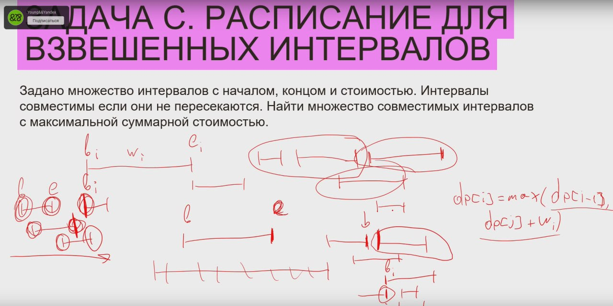
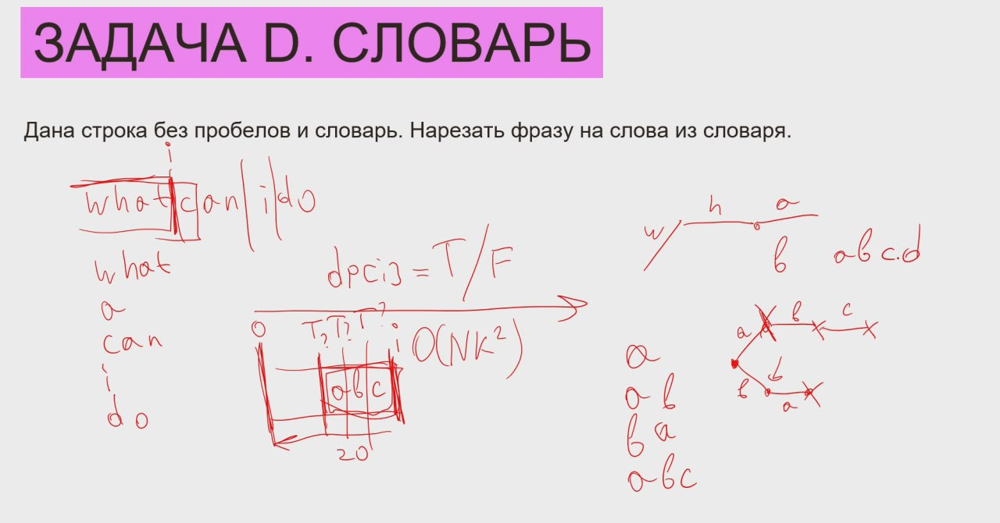
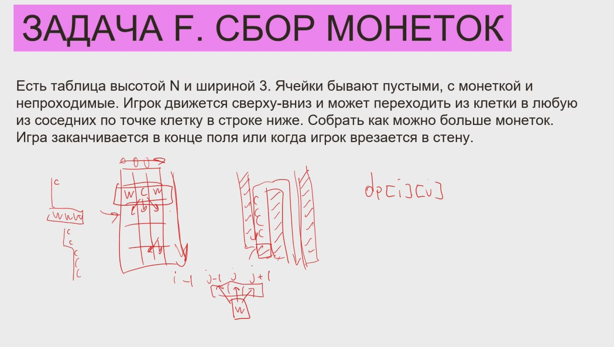

# Разбор задач второй части

## "Поход вдоль Москвы-реки"
смотри мою попытку решить её в `practice/taskB_camping.py`.

Хранить будем минимальное количество переправ, которое они совершат.
Другое измерение - это левый и правый берег.

Формула перехода: например, я хочу оказаться на i-ом шаге на левом берегу:
`dp[i][L]`. Как я могу сюда попасть ?
- либо через приток, либо через М-реку, но необходимо выбрать минимальное:
  - min(dp[i-1][L], dp[i-1][R]) + 1 # +1 потому что в любом случае нужно переправиться.

Это задача типа "измерения разного рода".

```py
s = '#' + input()
n = len(s)
dp = [[0, 0] for i in range(n)]
# чтобы оказаться изначально на правом берегу необходимо перейти
# через М-реку, потому что по условию изначально мы находимся
# на левом берегу.
dp[0] = [0, 1]

for i in range(1, n):
    # приток слева: либо переходим через него, либо переходим на правый берег
    if s[i] == 'L':
        # либо мы на левом берегу и переходим через левый приток (первый операнд ф-ии min)
        # либо мы на правом берегу и переходим через М-реку на левый
        dp[i][0] = min(dp[i-1][0], dp[i-1][1]) + 1
        # либо мы на левом берегу и переходим через М-реку, чтобы оказаться на правом
        # либо мы на правом берегу и просто переходим через, игнорируя приток
        dp[i][1] = min(dp[i-1][0] + 1, dp[i-1][1])
    # приток справа: либо переходим через него, либо переходим на левый берег
    elif s[i] == 'R':
        # либо мы находимся на левом берегу и просто проходим дальше,
        # либо мы находимся на правом берегу и чтобы перейти на левый берег, нам надо перейти М-реку
        dp[i][0] = min(dp[i-1][0], dp[i-1][1] + 1)
        # либо мы находимся на левом берегу и чтобы оказаться на правом нам нужно перейти М-реку,
        # либо мы уже находимся на правом и чтобы пересечь приток, нам надо перейти через него
        dp[i][1] = min(dp[i-1][0], dp[i-1][1]) + 1
    # притоки с обеих сторон:
    elif s[i] == 'B':
        # либо мы находися на левом берегу и просто проходим приток
        # либо мы находимся на правом берегу и мы переходим через М-реку +
        # проходим через приток, чтобы оказаться на левом берегу
        dp[i][0] = min(dp[i-1][0] + 1, dp[i-1][1] + 2)
        # либо мы находимся на правом берегу и просто проходим приток,
        # либо мы находимся на левом берегу и чтобы оказаться на правом,
        # нам нужно сначала перейти через М-реку и затем через приток.
        dp[i][1] = min(dp[i-1][1] + 1 , dp[i-1][0] + 2)

# по условию задачи, мы должны оказаться на правом берегу.
print(dp[n-1][1])
```

## "Расписание для взвешенных интервалов"

Условие: задано мн-во интервалов с началом, концом и стоимостью. Интервалы совместимы, если они **НЕ пересекаются**.
Найти множество совместимых интервалов с максимальной суммарной стоимостью.

Отобразим задачу на что-то реальное. Пусть мы проводим мероприятия и нам нужно сделать для себя расписание,
по которому мы получим больше всего денег.

Сначала нам нужно отсортировать все отрезки. dp[i] - максимальное кол-во денег, мы либо береём это мероприятие,
включая предыдущие, либо не берём. То есть в нашей динамике не обязательно браться этот i-ый отрезок.

Отрезки могут пересикаться, а нам нужно найти самый большой из них, то есть нужно найти такой отрезок в отсортированных, который начался **раньше окончания этого отрезка**. Нам нужно найти отрезок самый большой, имеющий
правый конец, который не превосходит нашего левого конца - это то последнее событие, которое мы можем
добавить, причём это событие может произойти одновременно - например, одно мероприятие кончилось и тут же началось другое. То есть нам надо найти самое большое число, меньшее либо равное b_i и вот отсюда, найдя индекс этого числа,
мы могли взять значение dp[j], где j-индекс предыдущего отрезка.



```py
from bisect import bisect_right

n = int(input())
intervals = []
for i in range(n):
    b, e, w = map(float, input().split())
    intervals.append((e, b, w))

intervals.sort()
dp = [0] * (n+1)

for i in range(1, n+1):
    e, b, w = intervals[i-1]
    # ищем самый большой интервал, у которого конец не превосходит рассматриваемого начала с помощью бин поиска:
    # ищем самый хороший среди хороших
    # prev = j в изображении выше
    prev = bisect_right(intervals, (b, e, w))
    dp[i] = max(dp[i-1], dp[prev] + w)

print(dp[n])
```

## "Словарь"

Условие: дана строка без пробелов и словарь. Нужно нарезать фразу на слова из словаря.
Пример:
Строка: `whatcanido`
Словарь: [what, can, i, do]

в `dp[i]` лежит значение либо `true`, либо `false` - можем ли мы нарезать префикc длиной i
на отдельные слова из словаря ?


Если хотим быстрее искать по словарю, то можно представить словарь в виде бора.

O(n*k^2)
`O(n*k)`, через бор

```py
s = '#' + input()
s_len = len(s)
poss_end = [False] * s_len # dp
prev_word = [''] * s_len # для восстановления
poss_end[0] = True
words = set() # словарь

n = int(input())
max_len = 0 # можно определить числом, являющимся ограничением, но в этом решении сделано так.

for i in range(n):
    word = input()
    max_len = max(max_len, len(word))
    words.add(word)

for i in range(1, s_len):
    # [0, 1); [0, 2), ... Если у нас префикс из 3-х первых букв, то мне бессмысленно рассматривать слова из 4-ёх и более букв - их просто не существует.
    for j in range(min(max_len, i)):
        # если можно закончить в i-j-1 (предыдущее слово закончилось тут) и если такая s[i-j:i+1] "вырезка" есть в словаре
        if poss_end[i - j - 1] and s[i - j:i + 1] in words:
            poss_end[i] = True
            prev_word[i] = s[i - j:i + 1]
            break

now = s_len - 1
ans []
while now > 0:
    ans.append(prev_word[now])
    now -= len(prev_word[now])

print(*ans[::-1])
```

## "Сбор монеток"

Условие: есть таблица высотой N и шириной 3. Ячейки бывают пустыми, с монеткой и непроходимые. Игрок движется сверху-вниз и может переходить из клетки в любую из 
*соседних по точке* клетку в строке ниже. Собрать как можно больше монеток. Игра заканчивается в конце поля или когда игрок врезается в стену.



Это двумерная динамика, но одно из измерений достаточное маленькое. Первое из измерений - шириной 3, а второе - это номер строки, в которой мы находимся (`[0,n)`)


`dp[i][j]` - макс. число монеток, которое мы можем заработать оказавшись в ячейке i,j. Как оно считается ? Нам нужно посмотреть на три ячейки сверху, иногда на две, если мы оказались возле стены.
И чтобы не замарчиваться с этими if-ами: если в центре, то такие варианты, если по бокам, то вот секие 2 варианта и так далее, то можно было бы сделать такие ограничители - ограничить поле искусственными стенами.
Тогда для каждой ячейки будет ровно три варианта.
Но в этом решении **не учитывается** тот факт, **когда мы врезались в стену**. Даже если мы будем обнулять: если в ячейке i,j стена, то мы скажем, что максимальное кол-во монеток у нас 0, то это будет работать не правильно, поэтому
это нужно будет как-то учесть - можно завести булевый массив, который будет отвечать на вопрос: "можем ли мы оказаться в этой клетке ?" и если нет, то помечаем, что не можем. Если ни в одной из трёх предыдущих мы не можем оказаться,
то мы и в рассматрвиаемой клетке не можем оказаться, даже если тут точка или монетка.

Где искать ответ ? Да везде искать ответ. Нам нужно просто в процессе работы запоминать сколько мы можем иметь максимально монеток.

```py
n = int(input())
# монетки на предыдущем шаге, 5 потому что 3 ячейки смежные +2 искусственные стеныы стен
coins_prev = [0] * 5
# две искусственные стенки по бокам и клетки по соседней точке сверху
can_prev = [False] + [True]*3 + [False]
ans = 0

for i in range(n):
    coins_now = [0] * 5
    s = 'W' + input() # 'W' - стена
    can_now = [False]*5 # изначально ни в какую клетку не могу перейти
    # смотрю в какую *клетку по точке* я могу перейти 
    for j in range(1, 4):
        # если в этой клетке не стена, а точка или монетка
        if s[j] != 'W':
            # смотрю смещения, куда я могу от этой клетке двинуться дальше по диагонали влево, в клетку выше или по диагонали вправо
            for dj in range(-1, 2):
                # если уже могу сейчас (было рассчитано на пред. шаге) или могу оказаться в одной из трёх соседних ячеек (ну, и в текущей получается тоже)
                can_now[j] = can_now[j] or can_prev[j+dj]
                # считаю количество макс. количетсво монеток в этой точке: максимум из того, что я уже имею и из того, что я могу в очередной ячейке по смещению накопить, которая находится надо мною.
                coins_now[j] = max(coins_now[j], coins_prev[j + dj])
            # если вдруг у меня лежит монета в j-ой ячейке
            coins_now[j] += s[j] == 'C'
            # если я не могу оказаться в этой ячейке, то я обнуляю кол-во монеток, чтобы моё решение работало правильно и не строило пути, по которым я не смогу добраться до конца поля
            if not can_now[j]:
                coins_now[j] = 0
            # и обновляю ans
            ans = max(ans, coins_now[j])
    # после этого, перед тем как перейти к следующему шагу я говорю, что на след. шаге, предыдущим шагом будет то, что было на этом шаге
    coins_prev = coins_now
    can_prev = can_now

print(ans)
```
